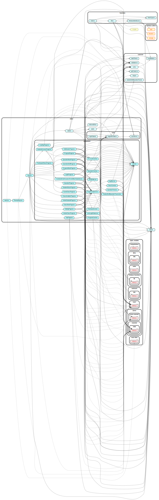

# quest

- Firebase
- TypeScript
- React
- Node.js
- esbuild

を使用しています

## 開発方法

リポジトリをクローンして

```ps1
npm i
```

を実行して使用しているパッケージをインストールします

```ps1
npm run start-development-build
```

または, VSCode の NPM スクリプトから `start-development-build` を実行するとビルドします.
`start-production-build` は本番用ビルドです (オリジンの指定が https://north-quest.web.app になる, Cloud Storage を使うようになるなど)

ビルドの結果は

- firebase.json
- distribution
- common/nowMode.ts
  に出力されます

Firebase の エミュレーターの起動は

```ps1
npm run start-emulator
```

でできます. `/distribution/functions/.runtimeconfig.json` に LINE ログインのチャンネルシークレットを事前に入れておく必要があります

### End to End (e2e) テスト

```ps1
npx cypress open
```
で cypress を起動してテストを実行できます. 事前に開発用サーバーを起動しておく必要あり

## リリース方法

GitHub Actions で Run Workflow ボタンを押して, ビルドとリリースができます.

- Deploy to Cloud Functions for Firebase
  - サーバーのプログラムを変えた分を反映させるために実行する
  - 時間が 3 分ほどかかるので注意
- Deploy to Firebase Hosting
  - クライアントのプログラムを変えた分を反映させるために実行する
  - 1 分以内に終わる

## 各ファイルの依存関係


