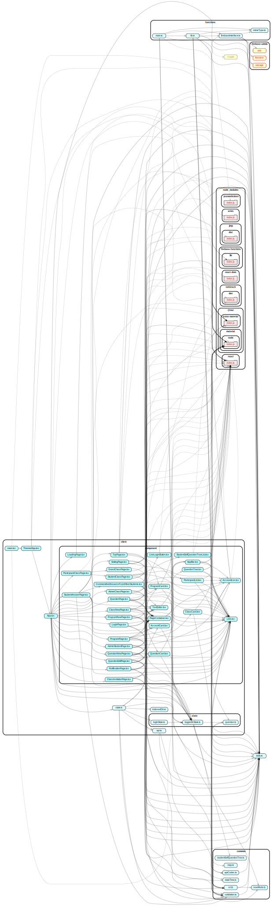

# quest

- Firebase
- TypeScript
- React
- Node.js
- esbuild

を使用しています

## 開発方法

リポジトリをクローンして

```ps1
npm i
```

を実行して使用しているパッケージをインストールします

```ps1
npm run start
```

または, VSCode の NPM スクリプトから `start` を実行するとビルドしたあとに Firebase の エミュレータを起動します.

ビルドの結果は

- firebase.json
- distribution
- common/nowMode.ts

に出力されます

LINE ログインのチャンネルシークレットを取得する必要があります.

### End to End (e2e) テスト

```ps1
npx cypress open
```

で cypress を起動してテストを実行できます. 事前に開発用サーバーを起動しておく必要あり

## リリース方法

GitHub Actions で Run Workflow ボタンを押して, ビルドとリリースができます.

- Deploy to Firebase
  - Firebase に 作成したプログラムを反映させる
  - 時間が 5 分ほどかかるので注意

## 各ファイルの依存関係


